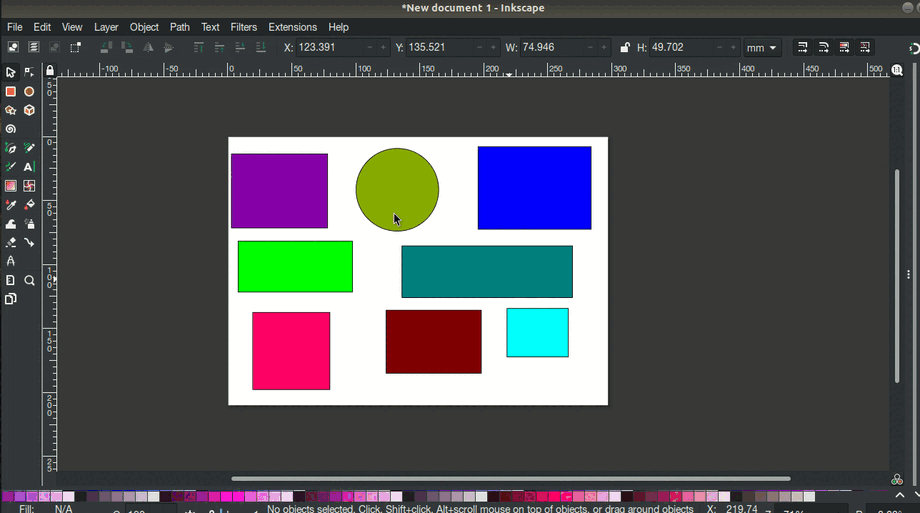

# RandomSelectionProperty

Randomly select a number of objects and change their properties (currently only `width` and `height`, but could be extended later).

# Installation:

## On Linux:

```
cd $HOME/.config/inkscape/extensions
git clone git@github.com:s1291/randomSelectionProperty.git
```

* Open Inkscape (if it is already open, close then re-open it) and you should find the extension under: **Extensions** > **Raster Perspective** > **Perspective**

## On Windows:

* Download the most recent version (direct link: [zip](https://github.com/s1291/randomSelectionProperty/archive/refs/heads/master.zip))
* Extract it and copy the files `random_selection.inx` and `random_selection.py` to `C:\Program Files\Inkscape\share\inkscape\extensions`


# How to use

- Select the objects.

- **Extensions** > **Modify Path** > **Batch property random selection**

See below:



# Author
Samir OUCHENE, 2021-2022

All code is licensed under the GNU General Public License version 3. See [the license file](https://github.com/s1291/randomSelectionProperty/blob/master/LICENSE) for details.
